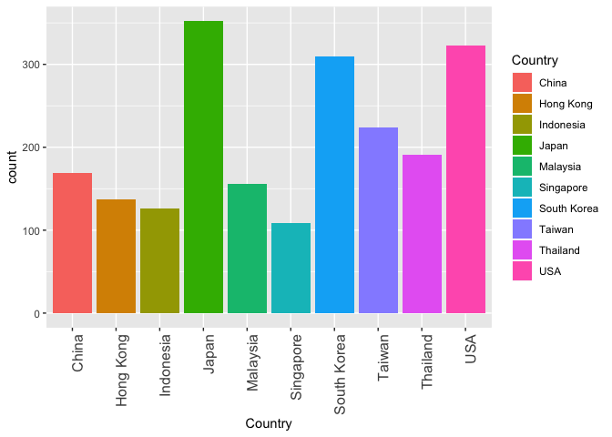

Assignment Overview
-------------------

**Create an Example** Using one or more TidyVerse packages, and any
dataset from fivethirtyeight.com or Kaggle, create a programming sample
“vignette” that demonstrates how to use one or more of the capabilities
of the selected TidyVerse package with your selected dataset.

    library(tidyverse)
    library(rmdformats)

Assignment Response
-------------------

For this assignment, I have chosen to demonstrate the basic
functionailty supplied by the dplry package that comes with tidyverse.

Datasource
----------

<a href="https://www.kaggle.com/residentmario/ramen-ratings/data" class="uri">https://www.kaggle.com/residentmario/ramen-ratings/data</a>

#### Import the Ramen Ratings dataset using the “readr” package.

    ramen_ratings <- read.csv("https://raw.githubusercontent.com/stephen-haslett/FALL2019TIDYVERSE/master/ramen-ratings.csv", header = TRUE)

#### Check that the data imported successfully.

    ramen_ratings <- as_tibble(ramen_ratings)
    head(ramen_ratings)

    ## # A tibble: 6 x 7
    ##   Review.. Brand     Variety                        Style Country  Stars Top.Ten
    ##      <int> <fct>     <fct>                          <fct> <fct>    <fct> <fct>  
    ## 1     2580 New Touch "T's Restaurant Tantanmen "    Cup   Japan    3.75  ""     
    ## 2     2579 Just Way  Noodles Spicy Hot Sesame Spic… Pack  Taiwan   1     ""     
    ## 3     2578 Nissin    Cup Noodles Chicken Vegetable  Cup   USA      2.25  ""     
    ## 4     2577 Wei Lih   GGE Ramen Snack Tomato Flavor  Pack  Taiwan   2.75  ""     
    ## 5     2576 Ching's … Singapore Curry                Pack  India    3.75  ""     
    ## 6     2575 Samyang … Kimchi song Song Ramen         Pack  South K… 4.75  ""

#### Using the “dplyr” package’s “slice” function, select a specific range of rows from the dataset.

    # Select rows 10 to 20 from the dataset.
    selected_rows <- slice(ramen_ratings, 10:19)
    selected_rows

    ## # A tibble: 10 x 7
    ##    Review.. Brand    Variety                        Style Country  Stars Top.Ten
    ##       <int> <fct>    <fct>                          <fct> <fct>    <fct> <fct>  
    ##  1     2571 KOKA     The Original Spicy Stir-Fried… Pack  Singapo… 2.5   ""     
    ##  2     2570 Tao Kae… Creamy tom Yum Kung Flavour    Pack  Thailand 5     ""     
    ##  3     2569 Yamachan Yokohama Tonkotsu Shoyu        Pack  USA      5     ""     
    ##  4     2568 Nongshim Mr. Bibim Stir-Fried Kimchi F… Pack  South K… 4.25  ""     
    ##  5     2567 Nissin   Deka Buto Kimchi Pork Flavor   Bowl  Japan    4.5   ""     
    ##  6     2566 Nissin   Demae Ramen Bar Noodle Aka To… Pack  Hong Ko… 5     ""     
    ##  7     2565 KOKA     Mushroom Flavour Instant Nood… Cup   Singapo… 3.5   ""     
    ##  8     2564 TRDP     Mario Masala Noodles           Pack  India    3.75  ""     
    ##  9     2563 Yamachan Tokyo Shoyu Ramen              Pack  USA      5     ""     
    ## 10     2562 Binh Tay Mi Hai Cua                     Pack  Vietnam  4     ""

#### Now use the “slice” function to select 2 row ranges, and 4 specific rows.

    # Select rows 2 to 9, 26 to 30, and rows 40, 21, 16, and 35.
    multiple_selected_rows <- ramen_ratings %>% slice(c(2:9, 26:30, 40, 21, 16, 35))
    multiple_selected_rows

    ## # A tibble: 17 x 7
    ##    Review.. Brand     Variety                       Style Country  Stars Top.Ten
    ##       <int> <fct>     <fct>                         <fct> <fct>    <fct> <fct>  
    ##  1     2579 Just Way  Noodles Spicy Hot Sesame Spi… Pack  Taiwan   1     ""     
    ##  2     2578 Nissin    Cup Noodles Chicken Vegetable Cup   USA      2.25  ""     
    ##  3     2577 Wei Lih   GGE Ramen Snack Tomato Flavor Pack  Taiwan   2.75  ""     
    ##  4     2576 Ching's … Singapore Curry               Pack  India    3.75  ""     
    ##  5     2575 Samyang … Kimchi song Song Ramen        Pack  South K… 4.75  ""     
    ##  6     2574 Acecook   Spice Deli Tantan Men With C… Cup   Japan    4     ""     
    ##  7     2573 Ikeda Sh… Nabeyaki Kitsune Udon         Tray  Japan    3.75  ""     
    ##  8     2572 Ripe'n'D… Hokkaido Soy Sauce Ramen      Pack  Japan    0.25  ""     
    ##  9     2555 Samyang … Song Song Kimchi Big Bowl     Bowl  South K… 4.25  ""     
    ## 10     2554 Yum-Mie   Instant Noodles Beef In Ligh… Pack  Ghana    3.5   ""     
    ## 11     2553 Nissin    Hakata Ramen Noodle White To… Bowl  Japan    4.75  ""     
    ## 12     2552 MyKuali   Penang White Curry Rice Verm… Bowl  Malaysia 5     ""     
    ## 13     2551 KOKA      Signature Tom Yum Flavor Ins… Pack  Singapo… 4     ""     
    ## 14     2541 Nissin    Cup Noodles Very Veggie Spic… Cup   USA      5     ""     
    ## 15     2560 Nissin    Cup Noodles Laksa Flavour     Cup   Hong Ko… 4.25  ""     
    ## 16     2565 KOKA      Mushroom Flavour Instant Noo… Cup   Singapo… 3.5   ""     
    ## 17     2546 New Touch Sugo-Men Kyoto Backfat Shoyu… Bowl  Japan    3.75  ""

#### Use dplyr’s “filter” function to select rows based on specified conditions.

*In this example, we will only select rows that have a 5 Star rating.*

    five_stars <- filter(ramen_ratings, Stars == 5)
    five_stars

    ## # A tibble: 369 x 7
    ##    Review.. Brand      Variety                      Style Country  Stars Top.Ten
    ##       <int> <fct>      <fct>                        <fct> <fct>    <fct> <fct>  
    ##  1     2570 Tao Kae N… Creamy tom Yum Kung Flavour  Pack  Thailand 5     ""     
    ##  2     2569 Yamachan   Yokohama Tonkotsu Shoyu      Pack  USA      5     ""     
    ##  3     2566 Nissin     Demae Ramen Bar Noodle Aka … Pack  Hong Ko… 5     ""     
    ##  4     2563 Yamachan   Tokyo Shoyu Ramen            Pack  USA      5     ""     
    ##  5     2559 Jackpot T… Beef Ramen                   Pack  USA      5     ""     
    ##  6     2558 KOKA       Creamy Soup With Crushed No… Cup   Singapo… 5     ""     
    ##  7     2552 MyKuali    Penang White Curry Rice Ver… Bowl  Malaysia 5     ""     
    ##  8     2550 Samyang F… Paegaejang Ramen             Pack  South K… 5     ""     
    ##  9     2545 KOKA       Instant Noodles Laksa Singa… Pack  Singapo… 5     ""     
    ## 10     2543 KOKA       Curry Flavour Instant Noodl… Cup   Singapo… 5     ""     
    ## # … with 359 more rows

#### Finally, use dplyr’s “select” function to select specific data columns from the dataset.

*In this example, we will select the “Brand”, “Variety”, “Country”,
“Stars”, and “Top.Ten” columns for brands that have a Top.Ten listing.*

    # Select only the rows with Top.Ten column entries whilst removing those
    # with NA, empty, or "\n" values.
    ramen_ratings_filtered <- filter(ramen_ratings, Top.Ten != "" & !is.na(Top.Ten) & Top.Ten != "\n")

    ramen_top_ten <- select(ramen_ratings_filtered, c("Brand", "Variety", "Country", "Stars", "Top.Ten"))
    ramen_top_ten

    ## # A tibble: 37 x 5
    ##    Brand         Variety                                  Country  Stars Top.Ten
    ##    <fct>         <fct>                                    <fct>    <fct> <fct>  
    ##  1 MAMA          Instant Noodles Coconut Milk Flavour     Myanmar  5     2016 #…
    ##  2 Prima Taste   Singapore Laksa Wholegrain La Mian       Singapo… 5     2016 #1
    ##  3 Prima         Juzz's Mee Creamy Chicken Flavour        Singapo… 5     2016 #8
    ##  4 Prima Taste   Singapore Curry Wholegrain La Mian       Singapo… 5     2016 #5
    ##  5 Tseng Noodles Scallion With Sichuan Pepper  Flavor     Taiwan   5     2016 #9
    ##  6 Wugudaochang  Tomato Beef Brisket Flavor Purple Potat… China    5     2016 #7
    ##  7 A-Sha Dry No… Veggie Noodle Tomato Noodle With Vine R… Taiwan   5     2015 #…
    ##  8 MyKuali       Penang Hokkien Prawn Noodle (New Improv… Malaysia 5     2015 #7
    ##  9 CarJEN        Nyonya Curry Laksa                       Malaysia 5     2015 #4
    ## 10 Maruchan      Gotsumori Sauce Yakisoba                 Japan    5     2015 #9
    ## # … with 27 more rows

Devanshu Mehrotra additions based on task 2 of the assignment
-------------------------------------------------------------

### Addition 1: We will be using the `group_by` , `tally` and top\_n functions to create a dataFrame containing countries along with the number of ramen restaurants reviewed.

According to the dplyr documentation the group\_by() function takes an
existing tbl and converts it into a grouped tbl where operations are
performed “by group”. Tally is just a wrapper to summarize the data by
counting how many elements within the group. We will also use the top\_n
function to seperate the top 10 countries by count of ramen
establishments

    # group by country and name of the column in which the tally is to be stored. Pick the top 10 countries by count
     ramen_counts <- (ramen_ratings) %>%
      group_by(Country) %>%
      tally(name = 'count') %>% 
      top_n(10)

    ## Selecting by count

### Addition 2: We will use ggplot() to visualize the datadrame from addition 1 above. This will happen in three steps

1.  ggplot() initialize a ggplot object which declares input data frame
    for a graphic and sets aesthetics intended to be common throughout
    all subsequent layers. Syntax for creating a ggplot object is
    ggplot(data = NULL, mapping = aes(), …)

Where: - data- dataset to used for plotting.

mapping - list of aesthetic mappings to use for plotting

Note that fill=Country just tells ggplot to color each country
seperately

1.  geom\_bar() creates a bar plot where the argument stat=‘identity’
    ensures that the length of the bars are determined by the counts of
    y axis

2.  Other arguments to determine the overall look of the visualiation

<!-- -->

    ggplot(ramen_counts, aes(x=Country, y=count, fill=Country ))+geom_bar(stat = "identity" ) + theme(axis.text.x = element_text(size=12, angle = 90, hjust = 1))

